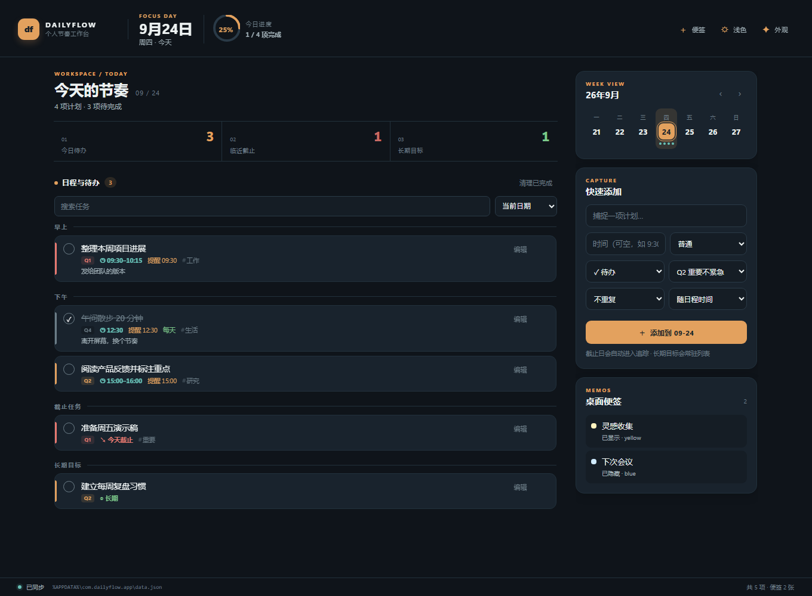
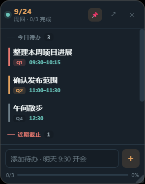

# DailyFlow

> 让今天的安排清楚可见。

DailyFlow 是一款面向 Windows 的本地优先日程工作台。把任务、日程、截止事项和长期目标放进一处管理，再用桌面悬浮窗把今天留在眼前。GUI 服务日常规划，CLI 则让脚本和 AI 助手也能读写同一份数据。



**Windows 桌面应用 · Rust + Tauri 2 · TypeScript + Vite · MIT License**

## 从捕捉到完成

- **今天一目了然**：按时间浏览今日日程和待办，查看完成进度、截止任务与长期目标。
- **快速记下新任务**：从主窗口或悬浮窗添加任务；支持优先级、标签、备注和四象限。
- **重要事项不再错过**：设置提醒，或让重复任务在完成后生成下一次计划。
- **临时想法有处安放**：创建多张桌面便签，自由拖动、缩放、置顶并选择颜色。
- **保持桌面轻盈**：通过系统托盘唤起窗口、切换今日悬浮窗或管理便签。
- **界面按习惯调整**：使用内置主题，也可逐项自定义颜色、圆角等外观变量并导入导出主题 JSON。

## 今日悬浮窗

悬浮窗常驻桌面，集中显示今天的任务、日程、临近截止事项和目标；可置顶、拖动、缩放，也能直接完成任务或快速添加。



## 为脚本和 AI 助手准备

DailyFlow CLI 与 GUI 共用本地数据文件。任务、便签、查询、统计和常用窗口开关都可通过命令行操作；窗口拖动和缩放等桌面交互仍在 GUI 中完成。数据命令返回单行 JSON；`dailyflow help` 默认输出可读文本，也可用 `dailyflow help --json` 获取机器可读帮助。

首次从终端或 AI 助手调用前，请在主界面“设置”中检测 PATH 并一键添加 DailyFlow 路径。

```powershell
dailyflow task add "团队周会" --date tomorrow --start 10:00 --end 11:00 --tags 工作
dailyflow day today
dailyflow note add "确认演示流程" --title "发布清单" --color blue
```

完整命令、参数、返回格式和 AI 工作流示例见 [CLI 参考](docs/CLI.md)。

### 安装 Skill

仓库内附带 [`dailyflow-cli` Skill](skills/dailyflow-cli/SKILL.md)，说明 AI 助手如何通过 CLI 查询和管理任务、日程与便签。将 `skills/dailyflow-cli` 目录安装到所用 AI 助手支持的 Skill 路径即可使用；本机还需安装 DailyFlow 并配置好 `PATH`。

## 安装与开发

### 从源码运行

需要 Node.js、Rust stable、Windows C++ Build Tools 和 WebView2 Runtime。

```powershell
npm install
npm run tauri dev
```

### 构建安装包

```powershell
npm run tauri build
```

Tauri 会在 `src-tauri/target/release/bundle/` 下生成适用于当前构建平台的安装包。

推送到 `main` 后，GitHub Actions 会自动构建 Windows x64 的 MSI、NSIS 安装包和 `dailyflow.exe`，并发布为一个新的 GitHub Release。前往 [Releases](https://github.com/Skydoge-zjm/DailyFlow/releases) 下载；每次工作流运行也会保留 30 天的 Actions 产物。

### 单独使用 CLI

从仓库根目录构建并运行：

```powershell
cargo build --manifest-path src-tauri/Cargo.toml
.\src-tauri\target\debug\dailyflow.exe help
```

开发时可通过 `DAILYFLOW_HOME` 将数据目录指向临时位置：

```powershell
$env:DAILYFLOW_HOME = "$env:TEMP\dailyflow-demo"
.\src-tauri\target\debug\dailyflow.exe task add "测试任务"
```

## 数据与隐私

任务、便签和设置保存在 `%APPDATA%\com.dailyflow.app\data.json`，使用本地 JSON 文件、跨进程文件锁和滚动备份，不需要云端账号。`DAILYFLOW_HOME` 可重定向数据目录。

数据文件包含 schema 版本：v1 数据会迁移到 v2；损坏数据、未知字段或不支持的版本会被报告并保留原文件。数据模型与同步机制见[设计文档](docs/DESIGN.md)。

## 许可证

[MIT License](LICENSE)
